# PDT Assignment 2

**Author**: Filip Mojto

Assignment Text
---

    Piate zadanie je zamerané na overenie vedomostí v oblasti PostGIS. Vašou úlohou bude vypracovať úlohy uvedené nižšie. Zadanie sa odovzdáva do 9.11.2023 23:59 a dostanete za neho 10 bodov.  Otázky 2-9 sú dokopy za 6 bodov (každá 0,75). Otázky 10 - 13 je za 4 body (každá 1). 

    Úlohy
    stiahnite a importujte si dataset pre Open Street mapy z https://download.geofabrik.de/europe/slovakia.html do novej DB
    zistite aké kraje sú na Slovensku (planet_osm_polygon, admin_level = ‘4’) a vypíšte súradnice ťažiska ako text s longitude a latitude. 
    zoraďte kraje podľa ich veľkosti (st_area). Veľkosť vypočítajte pomocou vhodnej funkcie a zobrazte v km^2 v SRID 5514.
    pridajte si dom, kde bývate ako polygón (nájdite si súradnice napr. cez google maps) do planet_osm_polygon (znova pozor na súradnicový systém). Výsledok zobrazte na mape.
    zistite v akom kraji je váš dom.
    pridajte si do planet_osm_point vašu aktuálnu polohu (pozor na súradnicovýsystém). Výsledok zobrazte na mape.
    zistite či ste doma - či je vaša poloha v rámci vášho bývania.
    zistite ako ďaleko sa nachádzate od FIIT (name = 'Fakulta informatiky a informačnýchtechnológií STU'). Pozor na správny súradnicový systém – vzdialenosť musí byť čo najpresnejšia.
    stiahnite si QGIS a vyplotujte kraje a váš dom z úlohy 2 na mape - napr. červenou čiarou.
    zistite súradnice centroidu (ťažiska) plošne najmenšieho okresu (vo výsledku nezabudnite uviesť aj EPSG kód súradnicového systému).
    vytvorte priestorovú tabuľku všetkých úsekov ciest, ktoré sa celé nachádzajú do 10 km od vzájomnej hranice okresov Malacky a Pezinok. Vytvorte ďalšiu tabuľku, ktorá bude obsahovať len tie úseky ciest, ktoré pretínajú túto hranicu okresov alebo sa jej dotýkajú. Výsledky overte ich zobrazením v prostrední QGIS.
    jedným dopytom zistite číslo a názov katastrálneho územia (z dát ZBGIS, https://www.geoportal.sk/sk/zbgis_smd/na-stiahnutie/), v ktorom sa nachádza najdlhší úsek cesty (z dát OSM) v okrese, v ktorom bývate.
    vytvorte oblasť Okolie_Bratislavy, ktorá bude zahŕňať zónu do 20 km od Bratislavy, ale nebude zahŕňať oblasť Bratislavy (Bratislava I až Bratislava V) a bude len na území Slovenska. Zistite jej výmeru.
    Výstup

    Výstup zadania je realizovaný formou protokolu, kde odpovedáte na jednotlivé otázky. Odpoveď pozostáva z SQL kódu, obrázku výstupu, mapy a zdôvodnenia. Protokol musí ďalej obsahovať všetky formálne náležitosti:
    Znenie zadania
    Meno a priezvisko riešiteľa
    Záver, kde zhodnotíte najväčšie úskalia a čo sa podarilo/nepodarilo realizovať.


## Task 1

To be able to import the data, we took the following approach:

1. Install Postgis extension from the link: [postgis](https://postgis.net/documentation/getting_started/install_windows/released_versions/)
2. Enable these extension in Pgadmin: postgis, hstore
    
    CREATE EXTENSION postgis;
    CREATE EXTENSION hstore;
    
3. Download osm2pgsql, a widely used OSM data importer, from the link: [osm2psql](https://osm2pgsql.org/doc/install.html)
4. Add path to osm2pgsql.exe to your environment variables.
5. Import the data by executing the following command:

    
    C:\Users\fmojt\Desktop\pdt_assigment_3>osm2pgsql -d <db_name> -U <db_username> -H <db_localhost> -W --create --slim --hstore --latlong --style <style_file_path> <data_file_path>
    

We verified the installation:

Assignment_4=# \dt
                  List of tables
 Schema |         Name         | Type  |  Owner
--------+----------------------+-------+----------
 public | osm2pgsql_properties | table | postgres
 public | planet_osm_line      | table | postgres
 public | planet_osm_nodes     | table | postgres
 public | planet_osm_point     | table | postgres
 public | planet_osm_polygon   | table | postgres
 public | planet_osm_rels      | table | postgres
 public | planet_osm_roads     | table | postgres
 public | planet_osm_ways      | table | postgres
 public | spatial_ref_sys      | table | postgres
(9 rows)

## Task 2

### SQL Query
```sql
SELECT
    name,
    ST_AsText(ST_Centroid(way)) AS centroid,
    way
FROM planet_osm_polygon
WHERE boundary = 'administrative'
  AND admin_level = '4'
  AND name IS NOT NULL;
```

### Description
This query selects all **administrative boundaries** at level 4 from the `planet_osm_polygon` table, which represent **Slovak regions**.  
The function `ST_Centroid(way)` calculates the **geometric center** of each region's polygon, and `ST_AsText` converts it to a readable text format.

### Purpose
We applied this query to **extract and visualize Slovak regional boundaries** from OpenStreetMap data stored in a PostGIS database.  
By including centroids, each region can be easily labeled or used for further spatial analysis.

### Results
The visualization below shows the **geographic representation of Slovak regions** based on the extracted data.

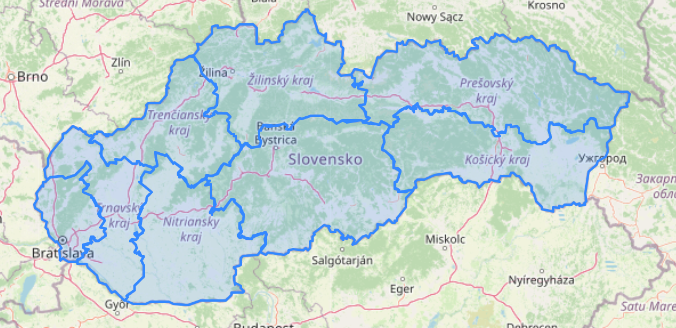

### Task 3

```sql
SELECT
    name,
    ROUND(
        CAST(
            ST_Area(ST_Transform(way, 5514)) / 1000000.0 AS numeric
        ), 2
    ) AS area_km2
FROM planet_osm_polygon
WHERE boundary = 'administrative'
  AND admin_level = '4'
  AND name IS NOT NULL
ORDER BY area_km2 DESC;
```

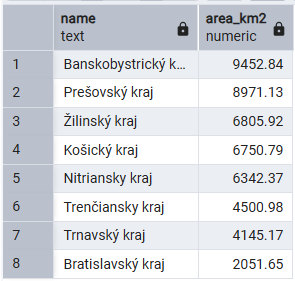

## Task 3 – Ranking Slovak Regions by Area

### SQL Query
```sql
SELECT
    name,
    ROUND(
        CAST(
            ST_Area(ST_Transform(way, 5514)) / 1000000.0 AS numeric
        ), 2
    ) AS area_km2
FROM planet_osm_polygon
WHERE boundary = 'administrative'
  AND admin_level = '4'
  AND name IS NOT NULL
ORDER BY area_km2 DESC;
```

### Description
This query calculates the **surface area of each Slovak region** using the geometries stored in the `planet_osm_polygon` table.  
To ensure accuracy, the geometries are transformed to the **EPSG:5514 (S-JTSK)** coordinate system using `ST_Transform`, which is suitable for measuring distances and areas within Slovakia.

The function `ST_Area` computes the area of each polygon in square meters, which is then converted to **square kilometers (km²)** by dividing by 1,000,000.  
Finally, the results are **rounded to two decimal places** and **sorted in descending order** by area.

### Purpose
We applied this query to **compare the sizes of Slovak regions** based on spatial data.  
By ranking them according to their computed areas, we can easily identify which regions occupy the largest and smallest portions of the country.

### Results
The table and visualization below show the **area of each Slovak region** in square kilometers, sorted from largest to smallest.


## Task 4

### SQL Query
```sql
INSERT INTO planet_osm_polygon (osm_id, name, way)
VALUES (
    -2,
    'Moj dom',
    ST_SetSRID(
        ST_GeomFromText('POLYGON((
            18.19960333783049 49.017853132036976,
            18.199538518803873 49.01788895018241,
            18.19976784766952 49.018063096354375,
            18.199830655041996 49.01802244094627,
            18.19960333783049 49.017853132036976
        ))'), 4326
    )
);

SELECT name, ST_AsText(way), way
FROM planet_osm_polygon
WHERE name = 'Moj dom';
```

### Description

This query inserts a **custom polygon representing the author's house** into the `planet_osm_polygon` table.

The function `ST_GeomFromText()` creates a polygon geometry from WKT (Well-Known Text) format, defining the **corners of the house boundary** using longitude and latitude coordinates obtained from Google Maps.

`ST_SetSRID(..., 4326)` explicitly sets the **spatial reference system to EPSG:4326** (WGS 84), which is the standard coordinate system for GPS coordinates.

The `osm_id` is set to `-2` (negative values are typically used for user-generated features to avoid conflicts with official OSM data).

### Purpose

We applied this query to **add a custom spatial feature** (the author's residential location) to the existing OpenStreetMap database.

This demonstrates the ability to:
- Convert real-world GPS coordinates into PostGIS-compatible geometry
- Properly handle coordinate reference systems (CRS)
- Insert custom spatial data alongside imported OSM data

The SELECT statement verifies the successful insertion by retrieving the newly added polygon, displaying both its text representation and geometric data.

### Results

The visualization below shows the **geographic representation of the author's house** as a polygon overlaid on the map.

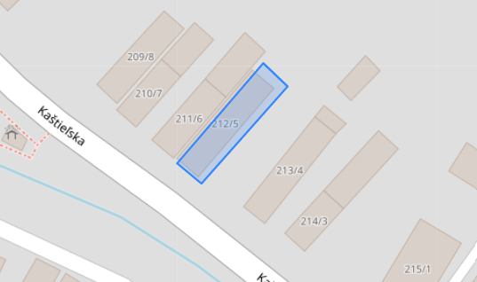

The polygon accurately represents the building footprint at the specified coordinates in **Žilina, Slovakia** (approximately 49.018°N, 18.200°E).

## Task 5

### SQL Query
```sql
SELECT r.name AS kraj
FROM planet_osm_polygon AS r
JOIN planet_osm_polygon AS d
  ON ST_Within(d.way, r.way)
WHERE r.boundary = 'administrative'
  AND r.admin_level = '4'
  AND d.name = 'Moj dom';
```

### Description

This query performs a **spatial join** to determine which Slovak region (kraj) contains the author's house.

The query uses two aliases of the `planet_osm_polygon` table:
- `r` represents regions (administrative boundaries at level 4)
- `d` represents the author's house polygon

The function `ST_Within(d.way, r.way)` performs a **spatial containment check**, returning TRUE when the house geometry is completely within a region's boundary.

The WHERE clause filters for:
- Administrative boundaries (`boundary = 'administrative'`)
- Regional level (`admin_level = '4'`)
- The specific house feature (`name = 'Moj dom_9'`)

### Purpose

We applied this query to **identify the administrative region** where the author's residence is located.

This demonstrates:
- Spatial relationship analysis using PostGIS
- The practical application of the `ST_Within()` function for point-in-polygon operations
- How to connect custom spatial data with official administrative boundaries


### Results

The query result shows the **name of the region** containing the author's house.


## Task 6

### SQL Query
```sql
INSERT INTO planet_osm_point (osm_id, name, way)
VALUES (
    -10,
    'Moja aktuálna poloha',
    ST_SetSRID(
        ST_GeomFromText('POINT(17.063111978578657 48.15919730926766)'), 4326
    )
);

SELECT name, ST_SRID(way), ST_AsText(way), way
FROM planet_osm_point
WHERE name = 'Moja aktuálna poloha';
```

### Description

This query inserts a **point geometry representing the author's current location** into the `planet_osm_point` table.

The function `ST_GeomFromText()` creates a point geometry from WKT (Well-Known Text) format using a single coordinate pair (longitude, latitude).

`ST_SetSRID(..., 4326)` sets the **spatial reference system to EPSG:4326** (WGS 84), ensuring compatibility with GPS coordinates and the existing OSM data.

The `osm_id` is set to `-10` (negative to distinguish user-generated features from official OSM data).

The SELECT statement verifies the insertion by:
- Retrieving the point's name
- Checking its SRID with `ST_SRID(way)`
- Displaying the coordinates as text with `ST_AsText(way)`
- Returning the full geometry object

### Purpose

We applied this query to **add the author's current position** as a spatial point feature in the database.

This demonstrates:
- The difference between polygon and point geometry insertion
- Proper handling of coordinate reference systems for point data
- How to store and retrieve precise location information in PostGIS


### Results

The visualization below shows the **geographic representation of the author's current location** as a point on the map.

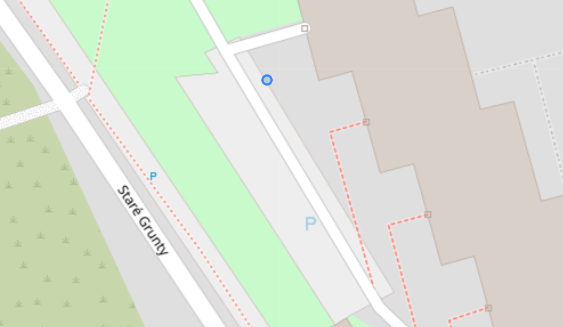

## Task 7

### SQL Query
```sql
SELECT 
    p.name AS poloha,
    h.name AS dom,
    CASE 
        WHEN ST_Within(p.way, h.way) THEN 1 
        ELSE 0 
    END AS som_doma
FROM planet_osm_point AS p
LEFT JOIN planet_osm_polygon AS h
  ON h.name = 'Moj dom'
WHERE p.name = 'Moja aktuálna poloha';

-- Test query with point inside house boundaries
INSERT INTO planet_osm_point (osm_id, name, way)
VALUES (
    -10,
    'Test Point',
    ST_SetSRID(
        ST_GeomFromText('POINT(18.19967322264156 49.01793475621987)'), 4326
    )
);
```

### Description

This query performs a **spatial containment check** to determine whether the author's current location is inside their home.

The query uses:
- `p` alias for the point table (author's current location)
- `h` alias for the polygon table (author's house)

A `LEFT JOIN` connects the location point with the house polygon based on the house name. The `ST_Within(p.way, h.way)` function checks if the point geometry lies completely within the polygon boundary.

The `CASE` statement returns:
- `1` if the location is within the house (som doma = "I am home")
- `0` if the location is outside the house boundaries

The additional INSERT statement creates a **test point** with coordinates deliberately placed within the house boundaries to **verify the correctness** of the spatial logic.

### Purpose

We applied this query to **validate the spatial relationship** between two user-defined geometries.

This demonstrates:
- Practical use of point-in-polygon spatial analysis
- Boolean spatial queries for location verification
- Testing methodology for spatial operations

### Results

The query results show whether the author is at home (som_doma = 1) or not (som_doma = 0).


**Verification test**: The test point (within the house polygon from Task 4) correctly returned `som_doma = 1`, confirming the spatial logic works as expected.

## Task 8

### SQL Query
```sql
SELECT 
    p.name AS moja_poloha,
    f.name AS ciel,
    ROUND(
        CAST(
            ST_Distance(
                ST_Transform(p.way, 5514),
                ST_Transform(f.way, 5514)
            ) AS numeric
        ), 2
    ) AS vzdialenost_m
FROM planet_osm_point AS p
CROSS JOIN planet_osm_point AS f
WHERE p.name = 'Moja aktuálna poloha'
  AND f.name = 'Fakulta informatiky a informačných technológií STU';
```

### Description

This query calculates the **precise distance** between the author's current location and the Faculty of Informatics and Information Technologies (FIIT) at STU.

The query uses:
- `CROSS JOIN` to combine the author's location point with the FIIT location point
- `ST_Transform(..., 5514)` to convert both geometries to **EPSG:5514 (S-JTSK / Krovak East North)**, a projected coordinate system designed for Slovakia that uses meters as units
- `ST_Distance()` to calculate the Euclidean distance between the two transformed points


The result is rounded to 2 decimal places for readability.

### Purpose

We applied this query to **calculate accurate real-world distances** between two geographic points in Slovakia.

This demonstrates:
- The importance of coordinate system transformation for distance calculations
- Selection of appropriate projected CRS for regional measurements
- Practical application of spatial distance functions in PostGIS


### Results

The query returns the distance in meters between the author's current position and FIIT STU.


The calculated distance represents the **straight-line (Euclidean) distance** between the two points, measured in the S-JTSK coordinate system, providing the most accurate result for locations in Slovakia.

## Task 9

In this task, we connected our pgadmin database with QGIS and executed some selection queries to get layers of Slovak regions and author's location.

### Results

The results are shown in the below images.

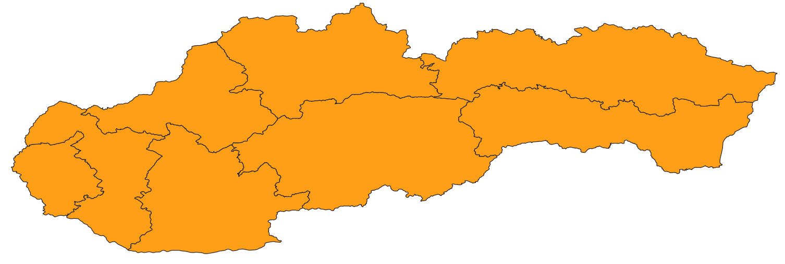

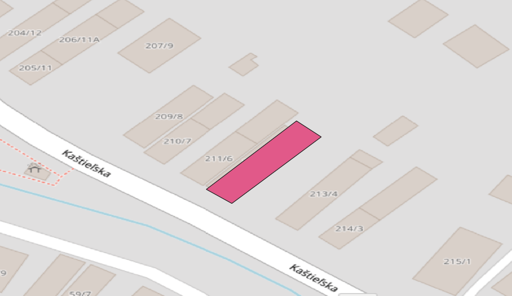

## Task 10

### SQL Query
```sql
SELECT
    d.name,
    ROUND(ST_Area(ST_Transform(d.way, 5514))::numeric / 1000000.0, 2) AS area_km2,
    ST_AsText(ST_Centroid(ST_Transform(d.way, 5514))) AS centroid_5514_wkt,
    ROUND(ST_X(ST_Centroid(ST_Transform(d.way, 5514)))::numeric, 2) AS centroid_x_5514_m,
    ROUND(ST_Y(ST_Centroid(ST_Transform(d.way, 5514)))::numeric, 2) AS centroid_y_5514_m,
    ST_AsText(ST_Transform(ST_Centroid(ST_Transform(d.way, 5514)), 4326)) AS centroid_4326_wkt,
    ROUND(ST_X(ST_Transform(ST_Centroid(ST_Transform(d.way, 5514)), 4326))::numeric, 6) AS longitude_4326,
    ROUND(ST_Y(ST_Transform(ST_Centroid(ST_Transform(d.way, 5514)), 4326))::numeric, 6) AS latitude_4326,
    'EPSG:5514' AS projected_crs,
    'EPSG:4326' AS geographic_crs
FROM planet_osm_polygon d
INNER JOIN planet_osm_polygon s
    ON s.boundary = 'administrative'
   AND s.admin_level = '2'
   AND s.name ILIKE '%Slovensk%'
   AND ST_Within(d.way, s.way)
WHERE d.boundary = 'administrative'
  AND d.admin_level = '8'
  AND d.name IS NOT NULL
ORDER BY ST_Area(ST_Transform(d.way, 5514)) ASC
LIMIT 1;
```

### Description

This query identifies the **smallest Slovak district by area** and calculates its centroid in multiple coordinate systems.

The query structure:
- Uses `INNER JOIN` with `ST_Within()` to ensure only districts within Slovakia are considered (admin_level = '2')
- Filters for districts (`admin_level = '8'`) with administrative boundaries
- Transforms geometries to **EPSG:5514** for accurate area calculation in square kilometers
- Calculates the centroid in both projected (EPSG:5514) and geographic (EPSG:4326) coordinate systems

Key functions used:
- `ST_Area(ST_Transform(d.way, 5514))` - calculates area in square meters using S-JTSK projection
- `ST_Centroid()` - computes the geometric center of the district polygon
- `ST_X()` and `ST_Y()` - extract X and Y coordinates from the centroid point
- `ST_Transform()` - converts between coordinate systems for different representations

The results include:
- District name and area in km²
- Centroid coordinates in EPSG:5514 (X, Y in meters)
- Centroid coordinates in EPSG:4326 (longitude, latitude in degrees)
- Both WKT text representations for verification

### Purpose

We applied this query to **identify and analyze the smallest administrative district** in Slovakia using precise spatial measurements.

This demonstrates:
- Complex spatial queries combining filtering, transformation, and aggregation
- Multi-CRS coordinate representation for different use cases
- Proper handling of hierarchical administrative boundaries
- Accurate area calculations using appropriate projected coordinate systems


### Results

The query returns comprehensive information about Slovakia's smallest district.

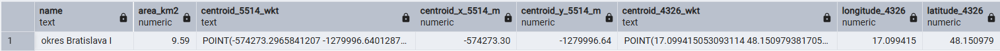

The results show the district name, its area in km², and the centroid coordinates in both:
- **EPSG:5514** (S-JTSK / Krovak East North) - X and Y in meters, suitable for Slovak national mapping
- **EPSG:4326** (WGS 84) - longitude and latitude in degrees, suitable for GPS and web mapping

## Task 11 - Roads within 10 km range

### SQL Query

To get all roads within 10 km from the crossing border between the two districts, the following query was proposed:

```sql
DROP TABLE IF EXISTS crossing_border;

CREATE TEMP TABLE IF NOT EXISTS crossing_border AS
SELECT ST_Intersection(d1.way, d2.way) AS way,
		d1.name AS district_a,
    	d2.name AS district_b
FROM planet_osm_polygon d1
JOIN planet_osm_polygon d2
ON d1.name = 'okres Pezinok' AND d2.name = 'okres Malacky'
WHERE d1.boundary = 'administrative' AND d2.boundary = 'administrative'
AND d1.admin_level = '8' and d2.admin_level = '8'; 


-- SELECT * FROM crossing_border;

DROP TABLE IF EXISTS border_buffer;

CREATE TEMP TABLE IF NOT EXISTS border_buffer AS
SELECT ST_Transform(ST_buffer(ST_Transform(cb.way, 3857), 10000), 4326) as buffer
FROM crossing_border as cb;

-- SELECT * FROM border_buffer;


DROP TABLE IF EXISTS roads_in_10_km;

CREATE TABLE roads_in_10_km AS
SELECT r.*
FROM border_buffer bb
JOIN planet_osm_roads r ON ST_Intersects(bb.buffer, r.way);

SELECT * FROM roads_in_10_km;
```

#### Crossing roads only

### Interpretation

To get the correct results, several temporary tables were created in a three-stage process:

**1. Crossing Border Table (`crossing_border`)**

This table identifies and extracts the exact boundary line where the two districts meet. Using `ST_Intersection()`, the query computes the geometric intersection between the polygon boundaries of okres Pezinok and okres Malacky.

**2. Border Buffer Table (`border_buffer`)**

This table creates a 10 km buffer zone around the crossing border line. The operation involves a coordinate transformation workflow: the border geometry is first transformed from WGS84 (EPSG:4326) to Web Mercator (EPSG:3857) using `ST_Transform()`, then buffered by 10,000 meters (10 km) using `ST_Buffer()`, and finally transformed back to WGS84 for consistency with the original OSM data coordinate system.

**3. Roads in 10 km Table (`roads_in_10_km`)**

This final table retrieves all roads that fall within or intersect the 10 km buffer zone. The `ST_Intersects()` function checks for any spatial overlap between the road geometries from `planet_osm_roads` and the buffer polygon, capturing all roads that are fully or partially within the defined distance from the border.


### Results

The results are shown via QGIS in the image below. It captures crossing border, buffer and the roads.

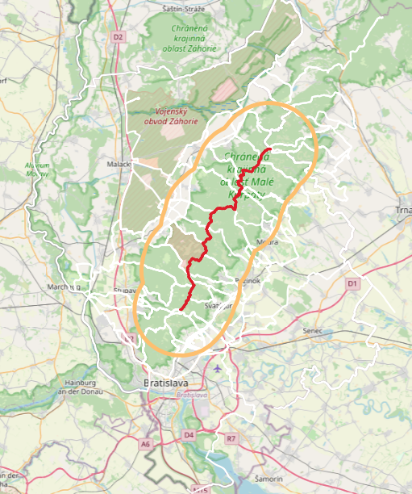

## Task 11 - Corssing-border roads only

### SQL Query

To get the crossing-border roads only, the already existing *crossing_border* table was used. The following query was executed.

```sql
CREATE TABLE crossing_roads AS
SELECT r.*
FROM crossing_border cb
JOIN planet_osm_roads r ON ST_Intersects(r.way, cb.way);

SELECT * FROM crossing_roads;
```

### Interpretation

This query identifies all roads that directly cross the border between okres Pezinok and okres Malacky. It creates a permanent table called `crossing_roads` by joining the previously computed `crossing_border` table with the `planet_osm_roads` table using a spatial intersection check.

The `ST_Intersects()` function evaluates whether each road geometry overlaps with the border line geometry.


### Results

The results are displayed using *QGIS* system, where the crossing border and the roads that directly interect it are highlighted.

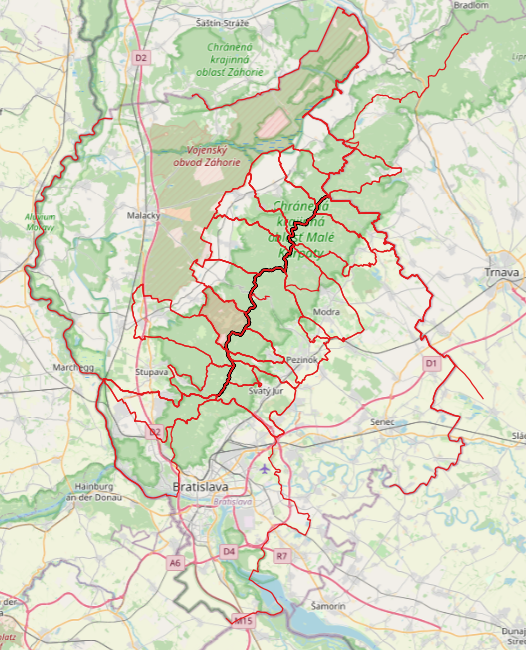

## Task 12

### SQL Query

```sql
DROP TABLE IF EXISTS road_lengths;

CREATE TEMP TABLE road_lengths AS
SELECT
    osm_id,
    name,
    ST_Length(ST_Transform(way, 5514)) AS length_meters,
    ST_Transform(way, 5514) AS geom
FROM planet_osm_roads r;


ALTER TABLE kataster_uzemia DROP COLUMN IF EXISTS geom_5514;

-- pre-trasnforming
ALTER TABLE kataster_uzemia ADD COLUMN geom_5514 geometry(MultiPolygon, 5514);
UPDATE kataster_uzemia
SET geom_5514 = ST_Transform(geom, 5514);

DROP TABLE IF EXISTS katasters;

CREATE TABLE katasters AS
SELECT
	id as id,
	ST_Intersection(ku.geom_5514, rl.geom) as geom,
    ku.id AS kataster_id,
    ku.nazov_ml AS kataster_name,
    rl.osm_id,
    rl.name AS road_name,
    rl.length_meters,
    rl.geom as road_geom
FROM kataster_uzemia ku
JOIN road_lengths rl
	ON rl.name ILIKE 'ilava' AND ku.nazov_ml ILIKE 'ilava%';

SELECT
	id,
    kataster_name,
    road_name,
    MAX(length_meters) AS longest_road_length
FROM katasters
WHERE kataster_name IN (
    SELECT nazov_ml
    FROM kataster_uzemia
)
GROUP BY id, kataster_name, road_name
ORDER BY longest_road_length DESC
LIMIT 1;	
```

### Interpretation

This query identifies the cadastral area within the Ilava district that contains the longest road segment. The analysis is performed through several interconnected steps:

**1. Road Length Calculation (`road_lengths` table)**

All roads from the OSM dataset are transformed to the S-JTSK coordinate system (EPSG:5514). This transformation is crucial because EPSG:5514 uses meters as units, enabling accurate length calculations using `ST_Length()`.

**2. Coordinate System Standardization**

To optimize performance and ensure geometric accuracy, the `kataster_uzemia` table is prepared by adding a pre-transformed geometry column (`geom_5514`). This avoids repeated on-the-fly transformations during spatial operations.

**3. Spatial Intersection (`katasters` table)**

The query performs a spatial join between cadastral areas and roads, filtering for entities related to "Ilava" using case-insensitive pattern matching (`ILIKE`). The `ST_Intersection()` function computes the exact geometry where each road segment overlaps with cadastral boundaries.

**4. Longest Road Identification**

The final SELECT statement aggregates the results by cadastral area and road name, using `MAX()` to find the longest road segment. The results are ordered by descending length and limited to the top result, revealing which cadastral area in the Ilava district contains the longest continuous road segment.


### Results

The results show the cadastral area with the longest road segment, including the cadastral area id, name, road_name and the precise length in meters of the longest road section within that area.

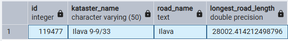

## Task 13

```sql
DROP TABLE IF EXISTS bratislava_buffer;
CREATE TABLE bratislava_buffer AS
SELECT ST_Transform(ST_Buffer(ST_Transform(cb.way, 5514), 20000), 5514) AS buffer
FROM planet_osm_polygon cb
WHERE cb.boundary = 'administrative'
  AND cb.admin_level = '6'
  AND cb.name ILIKE 'bratislava';

SELECT count(*) FROM slovakia_5514;

-- Slovakia polygon in 5514
DROP TABLE IF EXISTS slovakia_5514;
CREATE TABLE slovakia_5514 AS
SELECT ST_Transform(cb.way, 5514) AS geom
FROM planet_osm_polygon cb
WHERE cb.admin_level = '2' AND cb.name ILIKE 'slovensk%';

-- Clipping buffer to Slovakia
DROP TABLE IF EXISTS bratislava_buffer_clipped;
CREATE TABLE bratislava_buffer_clipped AS
SELECT ST_Intersection(bb.buffer, s.geom) AS buffer
FROM bratislava_buffer bb
CROSS JOIN slovakia_5514 s;

-- Uniting Bratislava districts
DROP TABLE IF EXISTS bratislava_districts_union;
CREATE TABLE bratislava_districts_union AS
SELECT ST_Union(ST_Transform(cb.way, 5514)) AS geom
FROM planet_osm_polygon cb
WHERE cb.boundary = 'administrative'
  AND cb.admin_level = '8'
  AND cb.name IN ('okres Bratislava I', 'okres Bratislava II', 
                  'okres Bratislava III', 'okres Bratislava IV', 'okres Bratislava V');

-- Excluding the districts from the buffer
DROP TABLE IF EXISTS bratislava_district_buffer;
CREATE TABLE bratislava_district_buffer AS
SELECT ST_Difference(bb.buffer, bd.geom) AS buffer
FROM bratislava_buffer_clipped bb
CROSS JOIN bratislava_districts_union bd;

-- Viewing result
SELECT * FROM bratislava_district_buffer;

-- Calculating the area
SELECT SUM(ST_Area(buffer)) AS vymera_m2
FROM bratislava_district_buffer;
```

### Interpretation

This query calculates the area of a 20 km buffer zone around Bratislava, excluding the city's own districts and clipped to Slovakia's borders. The analysis follows a multi-stage geometric processing workflow:

**1. Initial Buffer Creation (`bratislava_buffer`)**

A 20 km (20,000 meter) buffer zone is created around the Bratislava administrative boundary. The geometry is transformed to EPSG:5514 (S-JTSK) before buffering to ensure accurate metric distance calculations.

**2. Slovakia Boundary Extraction (`slovakia_5514`)**

The boundary of Slovakia is extracted and transformed to EPSG:5514. This polygon serves as a clipping mask to ensure the buffer zone doesn't extend beyond Slovakia's borders.

**3. Buffer Clipping (`bratislava_buffer_clipped`)**

Using `ST_Intersection()`, the buffer is clipped to Slovakia's national boundaries. 

**4. Bratislava Districts Union (`bratislava_districts_union`)**

All five Bratislava city districts (Bratislava I through V) are merged into a single unified polygon using `ST_Union()`. This creates a complete representation of the city that needs to be excluded from the final buffer zone.

**5. Final Buffer Calculation (`bratislava_district_buffer`)**

The `ST_Difference()` function subtracts the unified Bratislava districts from the clipped buffer, creating a shape that represents only the surrounding area within 20 km of the city, excluding the city itself. 

**6. Area Calculation**

Finally, `ST_Area()` computes the total area of this peripheral buffer zone in square meters. Since all operations were performed in EPSG:5514, the area measurement is accurate and uses metric units appropriate for Slovak geographic analysis.

### Results

The geographic visualization shows the 20 km buffer zone surrounding Bratislava (excluding the city districts themselves), clipped to Slovakia's borders. The tabular results display the total area of this peripheral zone in square meters.

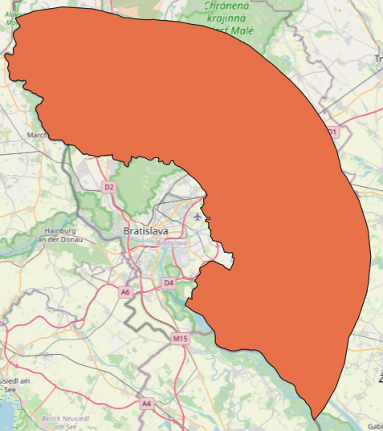

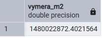

## Conclusion

This project successfully completed all assigned tasks, demonstrating comprehensive spatial analysis capabilities using PostGIS, OpenStreetMap data and QGIS vizualizer. Each task was properly documented with SQL queries, interpretations, and visual results.

**Greatest Challenges**

Tasks 11-13 presented the most significant technical hurdles, requiring substantial time and effort to achieve effective solutions. These tasks involved complex multi-stage geometric operations including:
- Precise boundary intersections and buffer zone calculations
- Coordinate system transformations between WGS84 and S-JTSK (EPSG:5514)
- Performance optimization through pre-transformation strategies
- Advanced set operations (union, difference, intersection) on complex geometries
-Visual verification of results through geographic and tabular representations

**Areas for Improvement**

Some queries could be optimized further for better performance.