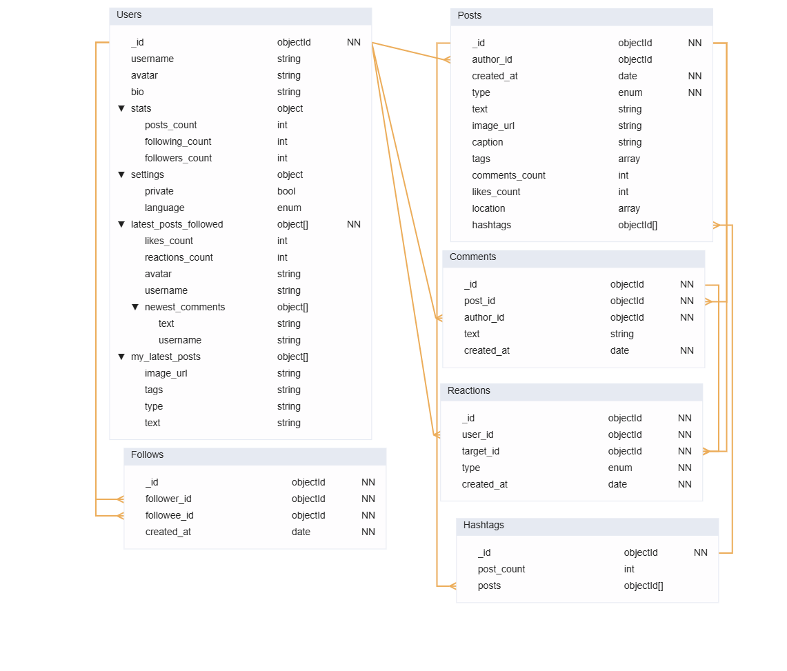

# PDT Assignment 6 - Data Modelling in MongoDB

---

## Design

The database design was modeled as a simple schema resembling a physical data model commonly used in relational systems.
However, unlike traditional SQL modeling, the NoSQL model also supports embedded subdocuments and denormalized structures to improve read performance.

In this design, we applied several well-known MongoDB schema design patterns:

1) **Subset**
2) **Polymorphic Pattern**
3) **Outlier Pattern**

### Subset Pattern

The **Subset Pattern** is used in the Users collection for the attributes:

- latest_posts_followed
- my_latest_posts

These fields store only a small, frequently accessed subset of related posts (e.g., the last 3–5 posts).
This allows the application to immediately display a user's personal feed and the newest posts from followed users without scanning or joining the entire Tweets collection.

These embedded subsets may include extra attributes such as:

- post metadata
- basic author info
- the latest comments on the post

This pattern dramatically reduces the number of queries required to load a timeline.

### Polymorhpic Pattern

The **Polymorphic Pattern** is used in the Tweets collection. Each tweet may have a different structure based on the post type:

- type: "text" → stores text
- type: "image" → stores image_url, caption
- type: "video" → stores video_url, duration

etc.

MongoDB allows documents within the same collection to have heterogeneous fields, so there is no need to create multiple SQL tables such as text_posts, image_posts, video_posts.

### Outlier Pattern

The Outlier Pattern is used in the Tweets collection for storing high-level counts such as:

- total number of replies
- total number of likes
- number of users followed
- number of followers

These fields are stored as separate attributes, not as embedded documents.
This avoids loading huge arrays when the only required information is the count.



## Design Rationale

### Subset Usage in the Users Collection

We applied the Subset Pattern in the Users collection for the attributes:

- *latest_posts_followed*
- *my_latest_posts*

These subsets store only a small, most frequently accessed portion of related posts.
When a user opens the application, one of the critical UX requirements is to load their feed as quickly as possible, without performing expensive queries across large collections.

By embedding the newest posts from followed users directly inside the user document:

- The feed loads immediately.
- No additional round-trip to the Tweets collection is required.
- Only the most relevant data is stored:
    - a short preview of the post,
    - a limited sample of comments,
    - author metadata such as *avatar* and *username*,
    - reaction counts like *likes_count* and *reactions_count*.

This denormalized representation drastically improves read performance for the most common action in a social media application: **loading the timeline**.

### Outlier Pattern for Counts

We used the Outlier Pattern in the Users collection for attributes such as:

- *posts_count*
- *following_count*
- *followers_count*

and similarly in the Posts collection for:

- *comments_count*
- *likes_count*

These values are stored as **top-level attributes**, not as embedded arrays.
The motivation is simple:

- Storing full embeddings (e.g., all follower IDs or all reaction objects) makes each user or post document grow excessively large.
- Reading large embedded arrays is slow and unnecessary when we only need the count.
- Keeping the counters as scalar values enables constant-time access and dramatically speeds up queries such as:

    - retrieving user profiles,
    - displaying post statistics,
    - ranking posts by popularity,
    - listing users by follower count.

This approach prevents loading potentially massive arrays and keeps frequently needed metrics lightweight and fast to access.

### Hashtags

Hashtags were stored in a separate Hashtags collection to support efficient search operations, especially autocomplete.
If hashtags were stored only as arrays inside the Posts collection, MongoDB would need to scan many posts just to check distinct tag values or to match a prefix. This becomes slow as the number of posts grows.

By placing hashtags in their own collection—where each hashtag is stored once and indexed—MongoDB can perform:

- **Instant autocomplete** using indexed prefix matching
- **Fast exact-match searches** (e.g., finding all posts with a given hashtag)
- **Efficient distinct operations**
- **Trending analytics** (counting posts per hashtag)
 
### Write Optimization Trade-off (Fan-Out on Write)
The architecture deliberately prioritizes read performance, especially on the homepage feed, which accounts for the majority of all operations.
Because all essential metadata—such as newest comments, reaction counts, and author information—is pre-embedded inside each user’s feed cache (latest_posts_followed), the system can load the timeline in a single lightweight query without touching the Posts, Comments, or Follows collections.

This design naturally introduces a write amplification cost:
operations such as creating a new post or adding a comment must update multiple locations:

- the Posts collection,
- the author's own feed subset (my_latest_posts), and
- the cached feed documents of every follower.

## JSON-like Examples

The json-like structure for the documents is already proposed in the diagram. However, we include some example instances:

### Example Documents

#### Users

```json
{
  "_id": ObjectId("675aaa100000000000000001"),
  "username": "filip",
  "avatar": "https://cdn.app/avatars/filip.png",
  "bio": "Software developer",
  "stats": {
    "posts_count": 34,
    "following_count": 88,
    "followers_count": 1200
  },
  "settings": {
    "private": false,
    "language": "sk"
  },

  "latest_posts_followed": [
    {
      "post_id": ObjectId("675aaa300000000000000011"),
      "username": "john",
      "avatar": "https://cdn.app/john.png",
      "text": "Hiking in the mountains!",
      "newest_comments": [
        {
          "username": "maria",
          "text": "Amazing view!"
        }
      ],
      "likes_count": 1400,
      "reactions_count": 1500
    }
  ],

  "my_latest_posts": [
    {
      "post_id": ObjectId("675aaa300000000000000021"),
      "type": "image",
      "image_url": "https://cdn.app/img/sky.jpg",
      "tags": ["sunset", "sky"],
      "text": null
    }
  ]
}
```

#### Posts

```json
{
  "_id": ObjectId("675aaa300000000000000011"),
  "author_id": ObjectId("675aaa100000000000000002"),
  "created_at": ISODate("2025-02-15T10:33:00Z"),
  "type": "image",
  "image_url": "https://cdn.app/img/sunset.png",
  "caption": "Beautiful sunset!",
  "text": null,
  "tags": ["sunset", "sky"],

  "comments_count": 412,
  "likes_count": 1400,

  "location": [48.1486, 17.1077]
}
```

#### Comments

```json
{
  "_id": ObjectId("675aac0000000000000000c1"),
  "post_id": ObjectId("675aaa300000000000000011"),
  "author_id": ObjectId("675aaa100000000000000001"),
  "text": "Amazing!",
  "created_at": ISODate("2025-02-15T10:35:10Z")
}
```

#### Reactions

```
{
  "_id": ObjectId("675aad0000000000000000f1"),
  "user_id": ObjectId("675aaa100000000000000001"),
  "target_id": ObjectId("675aac0000000000000000c1"),  // post OR comment
  "type": "like",
  "created_at": ISODate("2025-02-15T11:00:00Z")
}
```

#### Follows

```json
{
  "_id": ObjectId("675aab0000000000000000a1"),
  "follower_id": ObjectId("675aaa100000000000000001"),
  "followee_id": ObjectId("675aaa100000000000000002"),
  "created_at": ISODate("2025-02-14T18:00:00Z")
}
```

### CRUD Operation Examples

Below are some demonstrations of commonly used queries in our designed database.

#### User Feed (35%)

```json
//Fan-Out on Write
// All data are already provided and ready to be feeded
db.Users.findOne(
  { _id: USER_ID },
  { latest_posts_followed: 1, _id: 0 }
);
```

#### Clicking on Post (20%)

```json

// create index for faster search
db.Posts.createIndex({ _id: 1 });

// fetch post, getting the reactions counts (likes_count, reactions_count)
const post = db.Posts.findOne({ _id: POST_ID });

// getting author details
const author = db.Users.findOne(
  { _id: post.author_id },
  {
    projection: {
      username: 1,
      avatar: 1,
      bio: 1,
      stats: 1,
    }
  }
);

// get all comments for paginated
db.Comments.find({
  post_id: POST_ID,
  created_at: { $gt: lastLoadedTimestamp } 
})
.sort({ created_at: 1 })
.limit(10)
```

#### Insert a Reaction (15%)

```json
db.Reactions.insertOne({
  user_id: ObjectId("675aaa100000000000000001"),
  target_id: ObjectId("675aaa300000000000000011"), // can be a comment or post
  type: "like",
  created_at: new Date()
});
```

Increment counter atomically:

```json
db.Posts.updateOne(
  { _id: ObjectId("675aaa300000000000000011") },
  { $inc: { likes_count: 1 } }
);
```

#### Creating a Comment (10%)

```json
// create a new comment and insert into db
const inserted = db.Comments.insertOne({
  post_id: POST_ID,
  author_id: USER_ID,
  text: COMMENT_TEXT,
  created_at: new Date()
});

// remember the id
const commentId = inserted.insertedId;

// update the commented post's counts
db.Posts.updateOne(
  { _id: POST_ID },
  { $inc: { comments_count: 1 } }
);

// update the commented post's newest comments
db.Posts.updateOne(
  { _id: POST_ID },
  {
    $push: {
      newest_comments: {
        $each: [{
          text: COMMENT_TEXT,
          username: COMMENT_AUTHOR_USERNAME,
          created_at: new Date()
        }],
        $sort: { created_at: -1 },
        $slice: 3
      }
    }
  }
);
```

Update embedded comments in EVERY follower’s feed:

```json
// get the author of the post
const post = db.Posts.findOne({ _id: POST_ID }, { author_id: 1 });
const authorId = post.author_id;

//find all followers of the post author
const followers = db.Follows
  .find({ followee_id: authorId })
  .map(f => f.follower_id);

//update embedded newest_comments in each follower’s feed
db.Users.updateMany(
  { _id: { $in: followers } },
  {
    $push: {
      "latest_posts_followed.$[p].newest_comments": {
        $each: [{
          text: COMMENT_TEXT,
          username: COMMENT_AUTHOR_USERNAME,
          created_at: new Date()
        }],
        $sort: { created_at: -1 },
        $slice: 3
      }
    },
    $inc: { "latest_posts_followed.$[p].comments_count": 1 }
  },
  {
    arrayFilters: [
      { "p.post_id": POST_ID }
    ]
  }
);
```

#### Create a Post (5%)
```json
db.Posts.insertOne({
  author_id: ObjectId("675aaa100000000000000002"),
  created_at: new Date(),
  type: "text",
  text: "MongoDB is awesome!",
  tags: ["mongodb", "nosql"],
  comments_count: 0,
  likes_count: 0,
  location: [48.15, 17.10]
});

const result = db.Posts.insertOne(post);
const postId = result.insertedId;

// Increment  post_count

db.Users.updateOne(
  { _id: userId },
  {
    $inc: { "stats.posts_count": 1 }
  }
);

// Update my_latest_posts

db.Users.updateOne(
  { _id: userId },
  {
    $push: {
      my_latest_posts: {
        $each: [{
          post_id: postId,
          text: post.text,
          type: post.type,
          tags: post.tags,
          image_url: post.image_url,
          created_at: post.created_at,
          embedding: myEmbeddingVector
        }],
        $slice: -10 // keep only latest 10 posts
      }
    }
  }
);

// Update latest_posts_followed for all followers

const followers = db.Follows.find({ followee_id: userId }).toArray();

followers.forEach(f => {
  db.Users.updateOne(
    { _id: f.follower_id },
    {
      $push: {
        latest_posts_followed: {
          $each: [{
            post_id: postId,
            username: author.username,
            avatar: author.avatar,
            likes_count: 0,
            reactions_count: 0,
            created_at: post.created_at,
          }],
          $slice: -50 // keep latest 50 followed posts
        }
      }
    }
  );
});
```

#### Click on User's Profile (8%)

```json
// Get user metadata & counters
db.Users.findOne({ _id: userId })

// Get last posts from user
db.Posts.find({ author_id: userId })
        .sort({ created_at: -1 })
        .limit(10)

// ultra fast (fan-out-on-write model):
Users.my_latest_posts  (array)

```

#### Follow/Unfollow (<5%)

```json

// create indices
db.Follows.createIndex({ follower_id: 1, followee_id: 1 }, { unique: true });
db.Follows.createIndex({ followee_id: 1 });

// insert into follows
db.Follows.insertOne({
  follower_id: followerId,
  followee_id: followeeId,
  created_at: new Date()
});

// update counters
db.Users.updateOne(
  { _id: followerId },
  { $inc: { "stats.following_count": 1 } }
);

db.Users.updateOne(
  { _id: followeeId },
  { $inc: { "stats.followers_count": 1 } }
);

// fan-out: feed follower's newest posts

const posts = db.Posts
  .find({ author_id: followeeId })
  .sort({ created_at: -1 })
  .limit(10)
  .toArray();

posts.forEach(p => {
  db.Users.updateOne(
    { _id: followerId },
    {
      $push: {
        latest_posts_followed: {
          $each: [{
            post_id: p._id,
            image_url: p.image_url,
            text: p.text,
            created_at: p.created_at,
            likes_count: p.likes_count,
            reactions_count: p.reactions_count,
            author_username: author.username,
            author_avatar: author.avatar
          }],
          $slice: -50
        }
      }
    }
  );
});

```

#### Seach Users

Create index:

```json
// create index
db.Users.createIndex({ username: 1 });

// Automcomplete Query:
db.Users.find(
  { username: { $regex: "^fil", $options: "i" } },
  { projection: { username: 1, avatar: 1 } }
)
.limit(10);
```

#### Search Hashtags
Search:

```json
// create index
db.Posts.createIndex({ tags: 1, created_at: -1 });


db.Posts.find({ tags: "sunset" })
        .sort({ created_at: -1 })
        .limit(20);
```

Autocomplete:

```json
// create index
db.Hashtags.createIndex({ _id: 1 });

// autocomplete hashtags via regex
db.Hashtags.find(
  { _id: { $regex: "^su", $options: "i" } }
)
.limit(10);
```