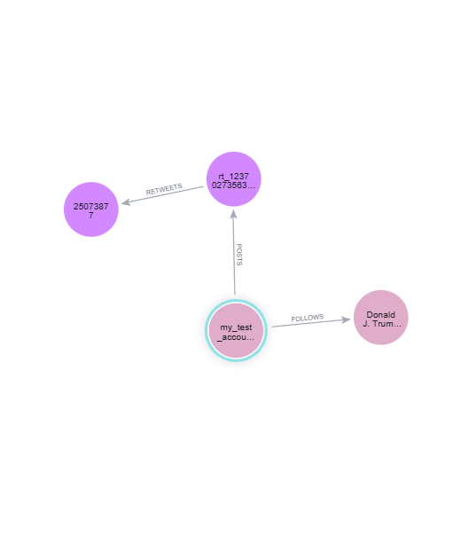

# PDT Assignment 7

**Author**: Filip Mojto

**Submission Date**: 20.12.2025

## Task 1

### Solution Query

```neo4j
// find trump's account
MATCH (trump:Account {screen_name: 'realDonaldTrump'})

// 2) find trump's original tweet by id
MATCH (trumpTweet:Tweet {id: '1237027356314869761'})

// 3) create / reuse new account
MERGE (acc:Account {screen_name: 'my_test_account'})

// 4) account follows Trump
MERGE (acc)-[:FOLLOWS]->(trump)

// 5) Account creates its own tweet (retweet)
MERGE (acc)-[:POSTS]->(rt:Tweet {id: 'rt_1237027356314869761'})

// 6) This tweet retweets Trump's tweet
MERGE (rt)-[:RETWEETS]->(trumpTweet)

// 7) Return relationships
RETURN acc, trump, rt, trumpTweet;
```

### Rationale

The query first matches Donald Trump’s account and one of his tweets by its ID. It then creates (or reuses) a new account using MERGE, ensuring no duplicates are created. The new account is connected to Trump’s account with a FOLLOWS relationship, posts a new tweet, and that tweet is linked to the original Trump tweet with a RETWEETS relationship. Finally, the query returns the involved nodes so the created structure can be visually inspected in the graph.

### Results



## Task 2

### Solution Query

```
MATCH (author:Account)-[:POSTS]->(orig:Tweet)<-[:RETWEETS]-(rt:Tweet)<-[:POSTS]-(retweeter:Account)
WHERE author <> retweeter
RETURN
  author.screen_name AS screen_name,
  count(DISTINCT retweeter) AS retweeting_accounts
ORDER BY retweeting_accounts DESC
LIMIT 10;
```

### Rationale

The query finds accounts whose tweets are widely retweeted by others. It matches original tweets posted by an author, then follows RETWEETS relationships from retweet tweets back to those originals, and finally identifies the accounts that posted the retweets. For each author, it counts the number of distinct accounts that retweeted their tweets, excluding self-retweets. The results are ordered by this count in descending order and limited to the top 10 accounts.

### Results

| screen_name | retweeting_accounts |
|---|---|
| dougmar_ | 3224 |
| maddieevelasco | 3056 |
| slothanova | 2867 |
| DonaldJTrumpJr | 2268 |
| ewarren | 1761 |
| iSmashFizzle | 1714 |
| replouiegohmert | 1612 |
| CarlosLoret | 1382 |
| TechnicalGuruji | 1364 |
| Virrrperez1 | 1357 |

## Task 3

### Solution Query

```
// Find accounts with at least 20 followers
MATCH (a:Account)<-[:FOLLOWS]-(follower:Account)
WITH a, count(DISTINCT follower) AS follower_count
WHERE follower_count >= 20

// Find tweets by the account that have no retweets
MATCH (a)-[:POSTS]->(t:Tweet)
WHERE NOT ( (:Tweet)-[:RETWEETS]->(t) )

RETURN
  a.screen_name AS screen_name,
  count(t) AS non_retweeted_tweets,
  follower_count AS followers
ORDER BY non_retweeted_tweets DESC
LIMIT 20;
```

### Rationale
The query first identifies accounts that have at least 20 followers by counting incoming FOLLOWS relationships. For those accounts, it then matches all tweets they posted and filters out tweets that have no incoming RETWEETS relationships, meaning they were never retweeted. Finally, it returns the account’s screen name, the number of non-retweeted tweets, and the number of followers, sorted by the number of non-retweeted tweets in descending order, limited to the top 20 accounts.

### Results

| screen_name | non_retweeted_tweets | followers |
|---|---|---|
| noticias24 | 8 | 64 |
| IndiaTodayFLASH | 7 | 82 |
| noticierovv | 7 | 62 |
| CaraotaDigital | 5 | 74 |
| holaterra | 5 | 96 |
| nayibbukele | 4 | 87 |
| DolarToday | 4 | 60 |
| MIB_India | 4 | 63 |
| kompascom | 4 | 65 |
| mediaindonesia | 4 | 73 |
| inquirerdotnet | 4 | 79 |
| McDonalds | 3 | 89 |
| lafm | 3 | 105 |
| latimes | 3 | 90 |
| DDNewslive | 3 | 66 |
| okezonenews | 3 | 61 |
| la_patilla | 3 | 59 |
| IndianExpress | 3 | 81 |
| PartidoPSUV | 2 | 79 |
| DZMMTeleRadyo | 2 | 90 |